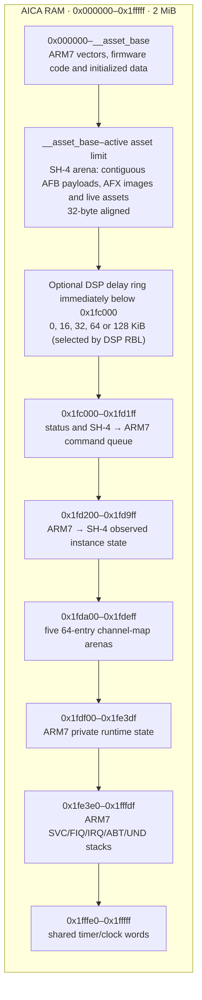

# AICA memory layout

AICAflow treats AICA RAM as one SH-4-owned arena. The ARM7 firmware reports
the first usable asset address and the active asset ceiling; it does not
allocate samples or interpret file formats. All uploads and asset allocations
are 32-byte aligned. This is required by the upload/DMA path; individual AFX
bytecode instructions are byte-addressed, not 32-byte records. Uploads round
and zero-pad backing allocations as needed; an AFX file's total byte length
need not itself be a multiple of 32.

`__asset_base` is firmware-dependent and is reported in the bootstrap status;
application code must not hard-code it. The asset ceiling is `0x1fc000` with no
external DSP ring. A DSP scene reserves its delay ring from the top of the
asset arena, reducing that ceiling by its selected 16–128 KiB size. A DSP
program with no external delay RAM reserves nothing.

AFB payloads are one contiguous allocation. The file header stays in SH-4
memory; only its payload is copied to AICA. AFX images are separate assets and
their bank-relative sample addresses are relocated once during upload. AFC
seek indexes remain only in SH-4 RAM; seeking may temporarily stage SH4-prepared
register states in AICA, not the index table.

AICA channel/DSP registers are memory-mapped I/O at `0x00800000`, not part of
the 2 MiB RAM pictured above. The allocator must never hand out the fixed
control region starting at `0x1fc000`.

For sample conversion and bank sizing, see
[AICAforge resource budgets](https://github.com/dfchil/AICAforge/blob/main/docs/authoring.md#output-and-resource-budgets).
