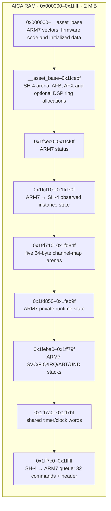

# AICA memory layout

[Documentation](README.md)

AICAflow treats AICA RAM as one SH-4-owned arena. The ARM7 firmware reports
the first usable asset address and the fixed asset ceiling; it does not
allocate samples or interpret file formats. All uploads and asset allocations
are 32-byte aligned. This is required by the upload/DMA path; individual AFX
bytecode instructions are byte-addressed, not 32-byte records. Uploads round
and zero-pad backing allocations as needed; an AFX file's total byte length
need not itself be a multiple of 32.

`__asset_base` is firmware-dependent and is reported in the bootstrap status;
application code must not hard-code it. The asset ceiling is `0x1fcec0`.
A DSP scene owns a contiguous, 2 KiB-aligned allocation within that arena:
16, 32, 64 or 128 KiB according to RBL. Assets can occupy space on either
side of it. A program with no external delay RAM allocates nothing.
Install memory-using scenes before loading assets to avoid fragmentation.

Fixed regions are adjacent, with the 32-byte-aligned command queue at the top
of RAM. Status occupies 80 bytes. Private state currently occupies 4,944 bytes;
the linker rejects growth that would overlap the unchanged stack reservations.
Increasing private state requires an explicit layout adjustment.

SH-4 retains a ring until ARM7 acknowledges DSP disable. An enable/disable
timeout leaves it allocated; retry disable or shut down the driver. Replacing
a scene stops the old scene before allocating the new ring, so an allocation
failure leaves DSP off. The asset ceiling does not change when DSP is enabled.

AFB payloads are one contiguous allocation. The file header stays in SH-4
memory; only its payload is copied to AICA. AFX images are uploaded unchanged,
with no retained SH-4 image copy. ARM7 adds the bound bank base to sample
addresses when applying NOTE and RESTORE. AFC
seek indexes remain only in SH-4 RAM; seeking may temporarily stage SH4-prepared
register states in AICA, not the index table. Seeking restores the preceding
AFC checkpoint directly; it does not read or replay AFX commands.

Each ARM7 playback context is 64 bytes. The bank base occupies 16 bits in
32-byte units; the context also stores the bank end for address validation.

SH-4 asset bookkeeping is 80 bytes per reserved slot. It stores one optional
bank handle and only the AFX metadata needed after loading, not the full file
header or an upload-image copy. AFC payloads are separate optional allocations.

AICA channel/DSP registers are memory-mapped I/O at `0x00800000`, not part of
the 2 MiB RAM pictured above. The allocator must never hand out the fixed
control region starting at `0x1fcec0`.

For sample conversion and bank sizing, see
[AICAforge resource budgets](https://github.com/dfchil/AICAforge/blob/main/docs/authoring.md#output-and-resource-budgets).
